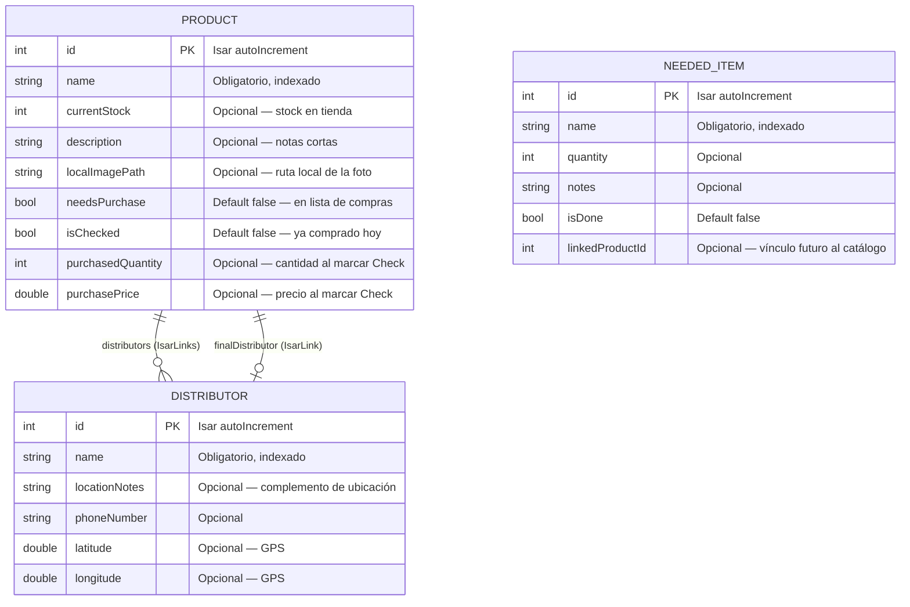
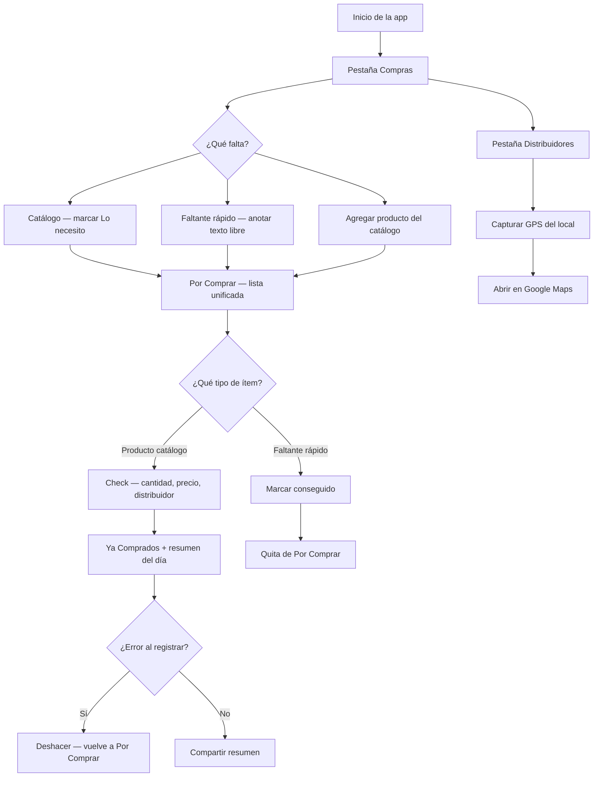

# Listado Axel

Aplicación móvil **offline-first** para comerciantes que gestionan compras de mercadería directamente en distribuidores. Reemplaza las listas de papel con una herramienta local, rápida y accesible.

## Propósito de la app

La app sirve para **armar la lista de lo que falta comprar** antes de ir al mercado:

- **Catálogo** = productos que ya conoces (referencia con foto, stock, distribuidores). No implica que haya que comprarlos hoy.
- **Por Comprar** = solo lo que **activamente necesitas** (productos marcados + faltantes rápidos).
- **Ya Comprados** = lo comprado en la salida actual.

## Características principales

- **100 % local**: sin conexión a internet en el mercado (Isar + archivos en disco).
- **Tres pestañas claras**: Compras, Catálogo y Distribuidores.
- **Lista intencional**: los productos del catálogo no aparecen en Por Comprar hasta marcarlos como necesarios.
- **Faltantes rápidos**: anotar en segundos algo que falta sin registrarlo en el catálogo.
- **Flujo de Check**: registrar cantidad, precio y distribuidor al comprar un producto del catálogo.
- Búsqueda en tiempo real: filtra ítems por nombre en Compras y en el Catálogo.
- **Deshacer compra**: revierte un producto de Ya Comprados a Por Comprar.
- **Banner de resumen del día**: total de unidades y dinero invertido, actualizado en vivo.
- **Compartir resumen**: exporta el reporte del día por WhatsApp, Telegram, correo o notas.
- **Fotos de productos**: cámara o galería, guardadas en almacenamiento interno.
- **GPS en distribuidores**: captura ubicación actual y abre el punto en Google Maps.
- **UX accesible**: textos grandes, alto contraste, botones táctiles amplios (mín. 48×48 dp).

## Stack tecnológico

| Componente        | Tecnología                          |
|-------------------|-------------------------------------|
| Framework         | Flutter (Material 3)                |
| Base de datos     | Isar (NoSQL local)                  |
| Fotos             | `image_picker` + `path_provider`    |
| Ubicación         | `geolocator` + `url_launcher`       |
| Compartir         | `share_plus`                        |
| Arquitectura      | Feature-first                       |

## Estructura del proyecto

```
lib/
├── main.dart
├── widgets/product_search_bar.dart
├── database/isar_service.dart
├── services/location_service.dart
├── models/
│   ├── distributor.dart
│   ├── needed_item.dart
│   └── product.dart
├── theme/app_theme.dart
└── features/
    ├── shopping_list/
    │   ├── utils/purchase_report_builder.dart
    │   └── widgets/
    ├── catalog/
    └── distributors/
```

## Funcionalidades de la Lista de Compras

| Función              | Descripción |
|----------------------|-------------|
| Por Comprar          | Solo productos con `needsPurchase = true` y faltantes rápidos activos. |
| Agregar del catálogo | Picker con búsqueda sobre productos que aún no están en la lista. |
| Faltante rápido      | Diálogo mínimo (nombre, cantidad y notas) mezclado en Por Comprar. |
| Marcar en catálogo   | Botón en cada tarjeta del catálogo para agregar/quitar de la lista. |
| Quitar de lista      | Botón en tarjetas de Por Comprar sin borrar el producto del catálogo. |
| Check de compra      | Diálogo con cantidad (+/−), precio y distribuidor (productos del catálogo). |
| Conseguido           | Marca un faltante rápido como hecho y lo quita de la lista. |
| Deshacer             | Botón en tarjetas de Ya Comprados; restaura `needsPurchase = true`. |
| Banner resumen       | Muestra unidades totales y monto invertido (Σ cantidad × precio). |
| Compartir            | Botón en AppBar (pestaña Ya Comprados) genera reporte en texto plano. |

## Diagrama Entidad-Relación (ERD)

Modelos de datos y relaciones Isar.



### Lógica de relaciones

| Relación            | Tipo Isar       | Cardinalidad | Descripción |
|---------------------|-----------------|--------------|-------------|
| `distributors`      | `IsarLinks`     | N : M        | Distribuidores donde **habitualmente** se consigue el producto. |
| `finalDistributor`  | `IsarLink`      | N : 1        | Distribuidor donde se **compró finalmente** el producto. |

### Estados del producto (`needsPurchase` + `isChecked`)

| `needsPurchase` | `isChecked` | Dónde aparece |
|-----------------|-------------|---------------|
| false | false | Solo Catálogo |
| true | false | Por Comprar |
| false | true | Ya Comprados |
| true | true | No ocurre — se limpia al comprar |

**Faltantes rápidos (`NeededItem`):**

- `isDone == false` → aparece mezclado en **Por Comprar**.
- Al marcar conseguido → `isDone = true`, sale de la lista (no va a Ya Comprados).

## Diagrama de flujo de usuario



## Formato del reporte compartido

Ejemplo generado dinámicamente por `PurchaseReportBuilder`:

```
🛒 *Resumen de Compra - 15 julio 2026*
💰 *Total Invertido:* $125.50 (18 unidades)
----------------------------------
* Arroz 1kg
  - Cantidad: 10 unidades
  - Precio unitario: $8.50
  - Subtotal: $85.00
  - Proveedor: Distribuidora El Centro

* Aceite 900ml
  - Cantidad: 8 unidades
  - Precio unitario: $5.06
  - Subtotal: $40.50
  - Proveedor: Mayorista Norte
```

## Cómo ejecutar

```bash
# Instalar dependencias
flutter pub get

# Generar código Isar (obligatorio tras cambiar modelos)
dart run build_runner build --delete-conflicting-outputs

# Ejecutar en dispositivo o emulador
flutter run

# Compilar APK
flutter build apk --release
```

### Regenerar modelos en desarrollo

```bash
dart run build_runner watch --delete-conflicting-outputs
```

## Criterios de accesibilidad aplicados

| Elemento              | Estándar aplicado                                      |
|-----------------------|--------------------------------------------------------|
| Texto de cuerpo       | 15 sp mínimo                                           |
| Etiquetas de campos   | 15 sp, negrita                                         |
| Títulos de sección    | 17–20 sp                                               |
| Botones principales   | Altura mínima 48 dp                                    |
| Botones +/− (Check)   | Área táctil mínima 44×44 dp                            |
| Contraste             | Verde (#059669) sobre fondo claro (#F8F9FA)            |

## Nota sobre datos existentes

Al introducir `needsPurchase = false` por defecto, un catálogo ya cargado mostrará **Por Comprar vacía** hasta marcar los productos que falten. Es el comportamiento esperado del nuevo modelo.

## Licencia

Proyecto privado — uso interno del comercio.
