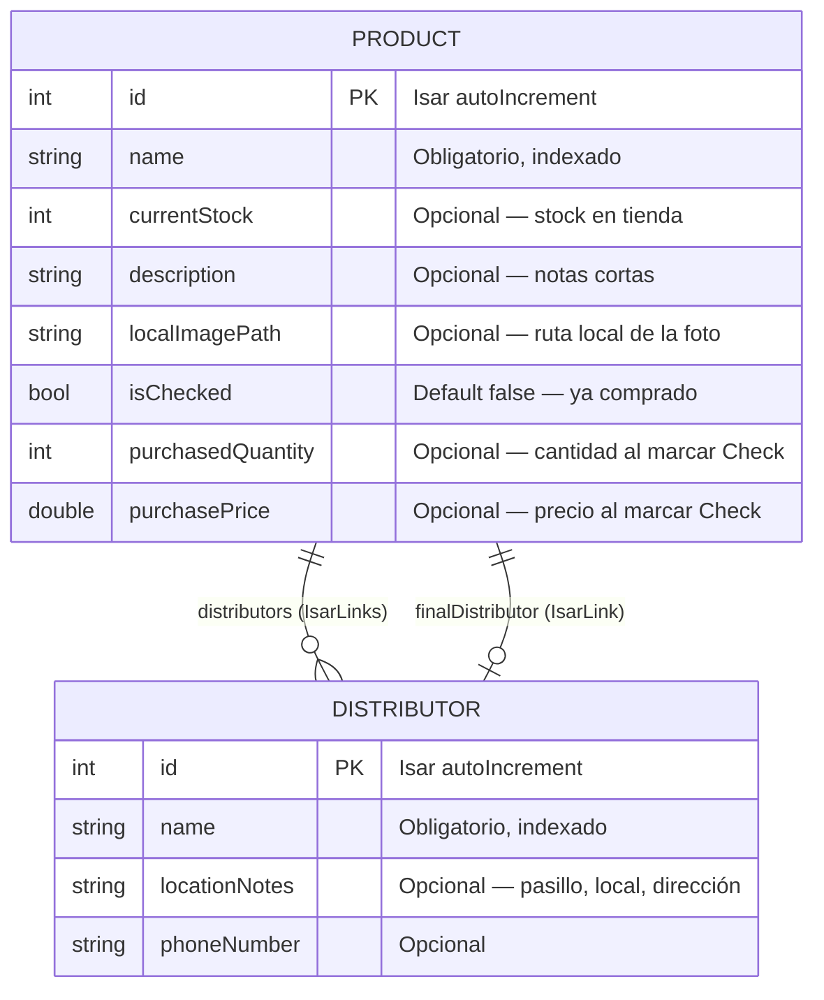
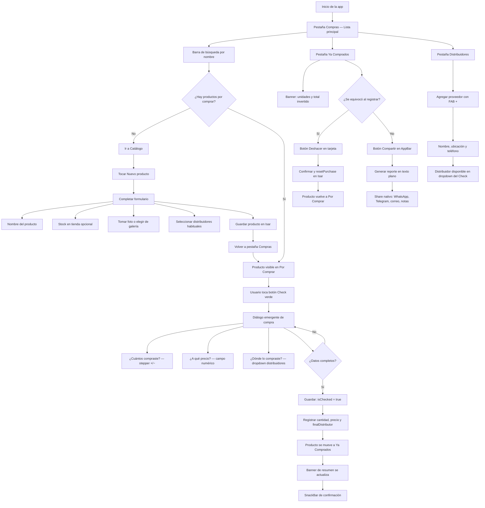

# Listado Axel

Aplicación móvil **offline-first** para comerciantes que gestionan compras de mercadería directamente en distribuidores. Reemplaza las listas de papel con una herramienta local, rápida y accesible.

## Características principales

- **100 % local**: sin conexión a internet en el mercado (Isar + archivos en disco).
- **Tres pestañas claras**: Compras, Catálogo y Distribuidores.
- **Flujo de Check**: registrar cantidad, precio y distribuidor al comprar un producto.
- Búsqueda en tiempo real: filtra productos por nombre en Compras y en el Catálogo.
- **Deshacer compra**: revierte un producto de Ya Comprados a Por Comprar.
- **Banner de resumen del día**: total de unidades y dinero invertido, actualizado en vivo.
- **Compartir resumen**: exporta el reporte del día por WhatsApp, Telegram, correo o notas.
- **Fotos de productos**: cámara o galería, guardadas en almacenamiento interno.
- **UX accesible**: textos grandes, alto contraste, botones táctiles amplios (mín. 48×48 dp).

## Stack tecnológico

| Componente        | Tecnología                          |
|-------------------|-------------------------------------|
| Framework         | Flutter (Material 3)                |
| Base de datos     | Isar (NoSQL local)                  |
| Fotos             | `image_picker` + `path_provider`    |
| Compartir         | `share_plus`                        |
| Arquitectura      | Feature-first                       |

## Estructura del proyecto

```
lib/
├── main.dart
├── widgets/product_search_bar.dart
├── database/isar_service.dart
├── models/
│   ├── distributor.dart
│   └── product.dart
├── theme/app_theme.dart
└── features/
    ├── shopping_list/
    │   ├── utils/purchase_report_builder.dart
    │   └── widgets/
    ├── catalog/
    └── distributors/
```

## Funcionalidades de la Lista de Compras

| Función              | Descripción |
|----------------------|-------------|
| Búsqueda (Compras)   | Barra superior que filtra por nombre en **Por Comprar** y **Ya Comprados**. |
| Búsqueda (Catálogo) | Barra superior que filtra el inventario general por nombre en tiempo real. |
| Check de compra      | Diálogo con cantidad (+/−), precio y distribuidor. |
| Deshacer             | Botón en tarjetas de Ya Comprados; limpia datos de compra y restaura `isChecked = false`. |
| Banner resumen       | Muestra unidades totales y monto invertido (Σ cantidad × precio). |
| Compartir            | Botón en AppBar (pestaña Ya Comprados) genera reporte en texto plano y abre el share nativo. |

## Diagrama Entidad-Relación (ERD)

Modelos de datos y relaciones Isar entre `Product` y `Distributor`.



### Lógica de relaciones

| Relación            | Tipo Isar       | Cardinalidad | Descripción |
|---------------------|-----------------|--------------|-------------|
| `distributors`      | `IsarLinks`     | N : M        | Distribuidores donde **habitualmente** se consigue el producto. Se asignan al crear/editar en el Catálogo. |
| `finalDistributor`  | `IsarLink`      | N : 1        | Distribuidor donde se **compró finalmente** el producto. Se asigna al completar el Diálogo de Check. |

**Estados del producto según `isChecked`:**

- `isChecked == false` → aparece en la pestaña **Por Comprar**.
- `isChecked == true` → aparece en **Ya Comprados**, con `purchasedQuantity`, `purchasePrice` y `finalDistributor` poblados.

## Diagrama de flujo de usuario

Recorrido completo desde la pantalla principal hasta compartir el resumen del día.



## Formato del reporte compartido

Ejemplo generado dinámicamente por `PurchaseReportBuilder`:

```
🛒 *Resumen de Compra - 15 julio 2026*
💰 *Total Invertido:* $125.50 (18 unidades)
----------------------------------
* Arroz 1kg
  - Cantidad: 10 unidades
  - Precio unitario: $8.50
  - Subtotal: $85.00
  - Proveedor: Distribuidora El Centro

* Aceite 900ml
  - Cantidad: 8 unidades
  - Precio unitario: $5.06
  - Subtotal: $40.50
  - Proveedor: Mayorista Norte
```

## Cómo ejecutar

```bash
# Instalar dependencias
flutter pub get

# Generar código Isar (obligatorio tras cambiar modelos)
dart run build_runner build --delete-conflicting-outputs

# Ejecutar en dispositivo o emulador
flutter run
```

### Regenerar modelos en desarrollo

```bash
dart run build_runner watch --delete-conflicting-outputs
```

## Criterios de accesibilidad aplicados

| Elemento              | Estándar aplicado                                      |
|-----------------------|--------------------------------------------------------|
| Texto de cuerpo       | 18 sp mínimo                                           |
| Etiquetas de campos   | 20 sp, negrita                                         |
| Títulos de sección    | 22–26 sp                                               |
| Botones principales   | Altura mínima 56 dp                                    |
| Botones +/− (Check)   | Área táctil mínima 48×48 dp                            |
| Botón compartir       | Área táctil mínima 48×48 dp en AppBar                  |
| Contraste             | Verde oscuro (#0D5C2E) sobre fondo claro (#F8F9FA)     |
| Imágenes en tarjetas  | Contenedor fijo + `BoxFit.cover` (sin deformación)     |

## Próximos pasos sugeridos

- Filtro por distribuidor en la lista de compras.
- Exportar resumen a PDF.
- Soporte `Semantics` ampliado para lectores de pantalla.

## Licencia

Proyecto privado — uso interno del comercio.
